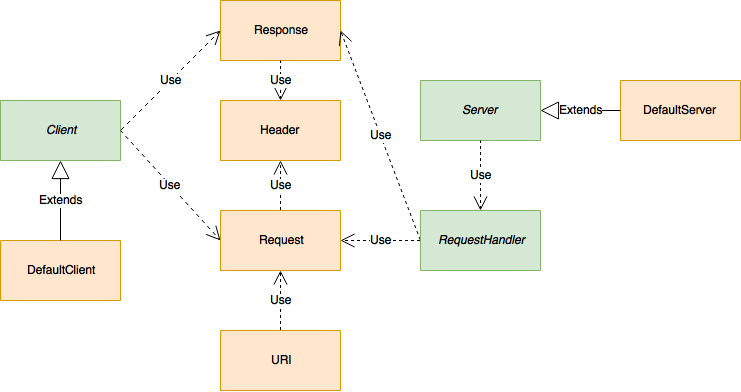

# HTTP Library design

1. [Purpose](#purpose)
2. [Client](#client)
3. [Server](#server)
4. [Request and Response](#request)
5. [HTTP Parsing](#parsing)
6. [Request Pipeline](#pipeline)



## Library Purpose <a name="purpose"></a>

HTTP is the main protocol of the Web. It is used for website, services and other means of communication. That is why providing interaction with HTTP servers and clients is a big priority for any general purpose programming language. Below main components of a library are described as well as their design. For description of each component please visit HTTP Reference.

Main interfaces which library offers are HTTP Server and HTTP Client. They allow to listen and send HTTP messages to hosts on various machines. It is important that implementation conforms to HTTP 1.1 standard, so that interoperability with other programming languages is possible.

## HTTP Client <a name="client"></a>

HTTP Client is an entity which allows to send http request to various resources. It provides access to configuring http request by providing http method, url and body if needed.

Example of a GET request

```
c = Client()
req = Request("www.example.com", HTTPMethod.GET)

res = req.send(req)

body = res.body.read()
```

## HTTP Server <a name="server"></a>

HTTP Server is an entity which allows to listen to incoming http request on a certain port. Its implementation is intended to be multithreaded and allows programmer to provide custom handler to each url route.

```

HelloHandler(req: Request) : Response is
    return http.createResponse("Hello World\n")
end

server = Server(8080)

s.setHandler("/hello", helloHandler)

server.start()
```

## Request and Response <a name="request"></a>

HTTP is a request-response protocol, so request and response are the main entities of interaction.

Request consists of the following fields:

* url - resource we are interested in, "http://www.example.com".
* method - which method we would like to invoke, such as GET, POST etc.
* headers - set of key-value pairs which provide additional information about request.
* body - optional payload we want to deliver, for example it may be JSON for POST request.

Response consists of the following fields:

* status - code which indicates status of request, for example 404 means that resource is not found
* headers - set of key-value pairs returned by the server
* body - result of the request, e.g page content when accessing website.

HTTP Client accepts request objects which it sends on the wire, HTTP Server allows populating response object inside handler function.

## HTTP Parsing <a name="parsing"></a>

Since HTTP is text protocol, we must use some sort of parser to transform to and from request and response objects. HTTP/2 is not supported, since it is much harder to parse.

## Request Pipeline <a name="pipeline"></a>

Below you can see the picture of how HTTP Request gets processed by the server:


